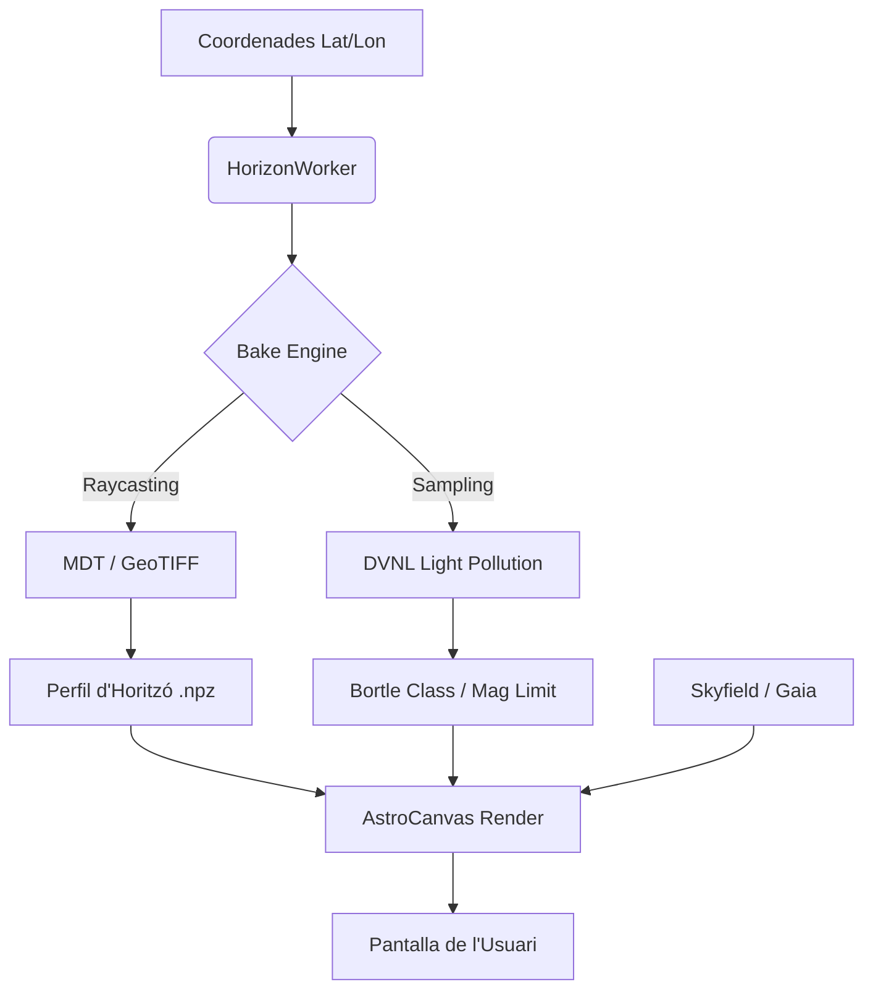

TerraLab combines **topographic analysis** with **astronomical rendering** to calculate what you can actually see from any location on Earth. The system processes terrain data, light pollution maps, and celestial catalogs to produce scientifically accurate sky simulations.

## Core Modules

TerraLab is organized into specialized subsystems:

### Terrain Engine (`TerraLab/terrain/`)
- **`engine.py`**: Horizon raycasting with Earth curvature correction
- **`providers.py`**: DEM data source abstraction (ICGC, Copernicus)
- **`worker.py`**: Background processing for horizon profiles
- **`light_pollution_sampler.py`**: Spatial sampling of DVNL radiance data

### Light Pollution Analysis (`TerraLab/light_pollution/`)
- **`calibration.py`**: DVNL-to-SQM regression model
- **`kernels.py`**: Gaussian and power-law convolution kernels
- **`bortle.py`**: SQM-to-Bortle scale mapping
- **`mlim.py`**: Limiting magnitude calculations with atmospheric extinction
- **`dvnl_io.py`**: GeoTIFF I/O for satellite light data

### Astronomical Rendering (`TerraLab/widgets/`)
- **`sky_widget.py`**: Main canvas with Skyfield integration
- **`visual_magnitude_engine.py`**: Atmospheric extinction and visibility models
- **`spherical_math.py`**: Coordinate transformations (RA/Dec ↔ Alt/Az)
- **`telescope_scope_mode.py`**: Field-of-view calculations

### Weather System (`TerraLab/weather/`)
- Real-time atmospheric conditions from Met.no API
- Cloud rendering and atmospheric effects

## Data Flow Pipeline

The following diagram shows how data flows from raw sources to the rendered output:



### Processing Stages

1. **Observer Coordinates** (Lat/Lon) → **UTM Transformation**
   - Converts WGS84 geographic coordinates to EPSG:25831 (UTM 31N) for metric operations
   - Source: `TerraLab/terrain/engine.py:832-834`

2. **DEM Tile Indexing**
   - Scans terrain tiles and builds spatial index with bounding boxes
   - Implements LRU cache with `.npy` binary serialization for fast reload
   - Source: `TerraLab/terrain/engine.py:203-266`

3. **Horizon Baking** (Raycasting)
   - 360° azimuth sweep with adaptive depth bands
   - Applies Earth curvature correction: $h_{\text{corr}} = \frac{d^2}{2R_{\text{earth}}}$
   - Source: `TerraLab/terrain/engine.py:649-809`

4. **Light Pollution Sampling**
   - Reads DVNL radiance from satellite GeoTIFF
   - Applies Gaussian kernel (σ = 1.5 km) to simulate zenith sky brightness
   - Converts to SQM via calibrated model: $\text{SQM} = 22.0 - 2.4 \cdot \log_{10}(\text{Radiance}_{\text{DVNL}} + 0.001)$
   - Source: `TerraLab/light_pollution/calibration.py:29-76`

5. **Astronomical Calculations**
   - Loads Gaia DR3 star catalog (RA, Dec, G magnitude, BP-RP color)
   - Computes planetary positions using Skyfield + DE421 ephemerides
   - Applies atmospheric refraction and extinction
   - Source: `TerraLab/widgets/sky_widget.py:604-772`

6. **Rendering**
   - Projects celestial objects using stereographic projection
   - Culls stars below limiting magnitude (calculated per-azimuth from Bortle + altitude)
   - Renders with realistic bloom/diffraction spikes for bright stars
   - Source: `TerraLab/widgets/sky_widget.py:893-1246`

## File Formats

### Input Data

| Format | Purpose | Location |
|--------|---------|----------|
| **ESRI ASCII Grid** (`.txt`, `.asc`) | Digital Elevation Models | `TerraLab/data/terrain/` |
| **GeoTIFF** | DVNL light pollution raster | `TerraLab/data/light_pollution/C_DVNL 2022.tif` |
| **JSON** | Gaia star catalog | `TerraLab/data/stars/gaia_stars.json` |
| **BSP** | JPL DE421 ephemerides | `TerraLab/data/stars/de421.bsp` |

### Cache Files

| Format | Purpose | Generated From |
|--------|---------|----------------|
| **`.npy`** | Binary DEM cache | ASCII Grid parsing (via pandas) |
| **`.npz`** | Horizon profiles | Raycasting output |
| **`gaia_cache_*.npy`** | Star catalog arrays | JSON parsing (RA, Dec, Mag, RGB) |

## Coordinate Systems

<Warning>
TerraLab is **CRS-aware** and handles multiple coordinate reference systems:

- **Geographic (WGS84)**: EPSG:4326 for user input (Lat/Lon)
- **Projected (UTM 31N)**: EPSG:25831 for metric calculations (X/Y in meters)
- **Celestial (ICRS)**: Equatorial coordinates (RA/Dec) from Gaia catalog
- **Light Pollution (Web Mercator)**: EPSG:8857 for DVNL satellite rasters
</Warning>

Coordinate transformations use `pyproj` for precision:

```python
# Geographic → UTM (for raycasting)
transformer = Transformer.from_crs("EPSG:4326", "EPSG:25831", always_xy=True)
x_utm, y_utm = transformer.transform(lon, lat)

# UTM → Geographic (for light pollution lookup)
x_utm, y_utm → lat, lon
```

Source: `TerraLab/terrain/engine.py:494-500`

## Performance Optimizations

### 1. Spatial Coherence Caching
The DEM sampler tracks the last accessed tile to avoid repeated index searches:
```python
if self.last_tile and self.last_tile != "NONE":
    xmin, ymin, xmax, ymax = self.last_tile["bbox"]
    if xmin <= x < xmax and ymin <= y < ymax:
        tile = self.last_tile  # Fast path
```
Source: `TerraLab/terrain/engine.py:511-514`

### 2. Adaptive Stepping
Raycasting uses variable step sizes based on distance:
- **0–3 km**: Fine steps (50m)
- **3–15 km**: Medium steps (100m)
- **15+ km**: Coarse steps (200m)

Source: `TerraLab/terrain/engine.py:783-790`

### 3. NumPy Vectorization
Star visibility calculations use vectorized operations:
```python
# Atmospheric extinction for all stars at once
airmass = 1.0 / (np.sin(np.radians(h_capped)) + 0.15 * (h_capped + 3.885)**-1.253)
airmass_penalty = k_ext * (airmass - 1.0)
local_limit = local_limit - airmass_penalty
```
Source: `TerraLab/widgets/sky_widget.py:978-983`

### 4. Asynchronous Loading
Catalog and ephemeris loading happens in background threads:
- `CatalogLoaderWorker`: Parses Gaia JSON → NumPy arrays
- `SkyfieldLoaderWorker`: Loads DE421 without UI freeze

Source: `TerraLab/widgets/sky_widget.py:604-790`

## Next Steps

Explore the subsystems in detail:
- [Horizon Engine](/concepts/horizon-engine) - Raycasting algorithm
- [Light Pollution](/concepts/light-pollution) - DVNL processing pipeline
- [Astronomical Rendering](/concepts/astronomical-rendering) - Skyfield integration