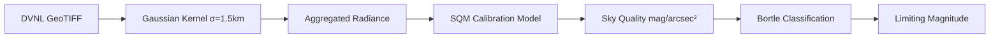

TerraLab converts satellite **DVNL** (Day/Night Visible Lights) radiance into **Sky Quality Meter** (SQM) readings and **Bortle Dark-Sky Scale** classifications. This pipeline uses **Gaussian convolution** to simulate how light propagates through the atmosphere, enabling automatic detection of observing conditions without manual input.

## Pipeline Overview



## DVNL Satellite Data

### Source

**Defense Meteorological Satellite Program** (DMSP) and **VIIRS** (Visible Infrared Imaging Radiometer Suite) provide nighttime radiance measurements at ~500m resolution.

- **Format**: GeoTIFF raster
- **Projection**: Web Mercator (EPSG:8857)
- **Units**: Radiance in nW/cm²/sr (nanowatts per square centimeter per steradian)
- **Location**: `TerraLab/data/light_pollution/C_DVNL 2022.tif`

Source: README.md line 86

### Reading DVNL Data

TerraLab uses `rasterio` for efficient GeoTIFF access:

```python
import rasterio
from rasterio.windows import Window

def read_raster_window_filtered(path: str, window: Window) -> np.ndarray:
    with rasterio.open(path) as src:
        arr = src.read(1, window=window).astype(np.float32)
        nodata = src.nodata
        if nodata is not None:
            arr[arr == nodata] = np.nan
        # Handle extreme values as missing data
        arr[arr > 1e10] = np.nan
        return arr
```

Source: `TerraLab/light_pollution/dvnl_io.py:19-38`

<Warning>
DVNL rasters use **Web Mercator projection**, not geographic coordinates. Always transform observer position from WGS84 (lat/lon) to EPSG:8857 before sampling.
</Warning>

## Gaussian Convolution Kernel

### Physical Justification

Light pollution at the **zenith** (directly overhead) comes from sources scattered across a wide area due to atmospheric scattering. A simple point sample would miss this diffusion. TerraLab applies a **Gaussian kernel** to aggregate radiance from nearby regions.

### Kernel Formula

$$
K(r) = \frac{1}{2\pi\sigma^2} \exp\left(-\frac{r^2}{2\sigma^2}\right)
$$

Where:
- $r$ = distance from center (km)
- $\sigma = 1.5$ km (standard deviation)
- $r_{\text{max}} = 3\sigma \approx 4.5$ km (cutoff radius)

Source: `TerraLab/light_pollution/kernels.py:10-35`

### Implementation

```python
def create_gaussian_kernel(sigma_km: float, max_radius_km: float, res_km: float) -> np.ndarray:
    """
    Creates a 2D Gaussian kernel for light propagation modeling.
    
    Args:
        sigma_km: Standard deviation (1.5 km for zenith sampling)
        max_radius_km: Cutoff radius (typically 3*sigma)
        res_km: Pixel resolution of DVNL raster
    
    Returns:
        Normalized 2D kernel array
    """
    halo = int(np.ceil(max_radius_km / res_km))
    n = 2 * halo + 1
    y, x = np.ogrid[-halo:halo+1, -halo:halo+1]
    
    r_km = np.sqrt(x*x + y*y) * res_km
    
    kernel = np.exp(-(r_km**2) / (2.0 * sigma_km**2))
    kernel[r_km > max_radius_km] = 0.0  # Hard cutoff
    
    # Normalize to sum = 1
    kernel /= kernel.sum()
    
    return kernel
```

Source: `TerraLab/light_pollution/kernels.py:10-35`

### Convolution Operation

Given a DVNL raster $I(x, y)$ and kernel $K$:

$$
R_{\text{agg}}(x_0, y_0) = \sum_{i,j} I(x_0 + i, y_0 + j) \cdot K(i, j)
$$

This produces a **smoothed radiance map** representing light arriving at zenith from all directions.

<Note>
The σ = 1.5 km value is calibrated to match **SQM field measurements** from the Catalan Pyrenees (Montsec Astronomical Observatory).
</Note>

## SQM Calibration Model

### Regression Formula

The relationship between aggregated DVNL radiance and SQM is **logarithmic**:

$$
\text{SQM} = \alpha + \beta \cdot \log_{10}(R_{\text{agg}} + \epsilon) + \gamma \cdot \frac{z}{1000}
$$

Where:
- $\alpha \approx 22.0$ (pristine sky baseline)
- $\beta \approx -2.4$ (empirical slope)
- $\epsilon = 0.001$ (regularization for zero radiance)
- $z$ = observer elevation (meters)
- $\gamma$ = elevation correction factor

Source: README.md line 35, `TerraLab/light_pollution/calibration.py:29-76`

### Simplified Model

For quick estimates without elevation data:

$$
\text{SQM} = 22.0 - 2.4 \cdot \log_{10}(R_{\text{agg}} + 0.001)
$$

### Implementation

```python
class SQMCalibrationModel:
    def __init__(self, epsilon: float = 1e-3):
        self.epsilon = epsilon
        self.model = None  # HuberRegressor from sklearn
    
    def predict(self, aggregated_dvnl: np.ndarray, elevation_m: np.ndarray) -> np.ndarray:
        """
        Predicts SQM from aggregated radiance.
        
        Args:
            aggregated_dvnl: Post-convolution radiance values
            elevation_m: Observer elevation (meters)
        
        Returns:
            SQM values in mag/arcsec²
        """
        X1 = np.log10(aggregated_dvnl + self.epsilon)
        X2 = elevation_m / 1000.0
        
        X = np.column_stack([X1.ravel(), X2.ravel()])
        y_pred = self.model.predict(X)
        return y_pred.reshape(X1.shape)
```

Source: `TerraLab/light_pollution/calibration.py:49-76`

### Calibration Data

The model is trained on **ground-truth SQM measurements** from:
- Montsec Astronomical Park (Bortle 1–2)
- Barcelona metropolitan area (Bortle 8–9)
- Rural Catalonia sites (Bortle 3–5)

Training uses **HuberRegressor** (robust to outliers from clouds/temporary lights).

Source: `TerraLab/light_pollution/calibration.py:14-47`

## Bortle Scale Mapping

### SQM to Bortle Conversion

The **Bortle Dark-Sky Scale** (1–9) categorizes observing conditions:

```python
def sqm_to_bortle_class(sqm: float) -> int:
    """
    Converts SQM reading to Bortle class.
    
    Args:
        sqm: Sky brightness (mag/arcsec²)
    
    Returns:
        Bortle class (1=Excellent, 9=Inner City)
    """
    if sqm >= 21.99:   return 1  # Excellent dark sky
    elif sqm >= 21.89: return 2  # Typical dark sky
    elif sqm >= 21.69: return 3  # Rural sky
    elif sqm >= 20.49: return 4  # Rural/suburban transition
    elif sqm >= 19.50: return 5  # Suburban sky
    elif sqm >= 18.94: return 6  # Bright suburban
    elif sqm >= 18.38: return 7  # Suburban/urban transition
    elif sqm >= 17.80: return 8  # City sky
    else:              return 9  # Inner city
```

Source: `TerraLab/light_pollution/bortle.py:7-35`

### Thresholds Table

| Bortle | SQM Range | Naked-eye Mag Limit | Milky Way Visibility |
|--------|-----------|---------------------|----------------------|
| **1** | ≥21.99 | 7.6–8.0 | Highly detailed structure |
| **2** | 21.89–21.98 | 7.1–7.5 | M31 visible to naked eye |
| **3** | 21.69–21.88 | 6.6–7.0 | Milky Way shows structure |
| **4** | 20.49–21.68 | 6.1–6.5 | Milky Way visible overhead |
| **5** | 19.50–20.48 | 5.6–6.0 | Milky Way very weak |
| **6** | 18.94–19.49 | 5.1–5.5 | Only hints of Milky Way |
| **7** | 18.38–18.93 | 4.6–5.0 | Milky Way invisible |
| **8** | 17.80–18.37 | 4.1–4.5 | Only brightest stars |
| **9** | Below 17.80 | 4.0 or less | Constellations barely recognizable |

## Limiting Magnitude Calculation

### Zenith Formula

The **visual limiting magnitude** at zenith (90° altitude) depends on Bortle class:

$$
m_{\text{lim,zenith}} = 7.6 - 0.5 \cdot (B - 1)
$$

Where $B$ is the Bortle class (1–9).

Examples:
- **Bortle 1**: $m_{\text{lim}} = 7.6 - 0.5 \times 0 = 7.6$
- **Bortle 5**: $m_{\text{lim}} = 7.6 - 0.5 \times 4 = 5.6$
- **Bortle 9**: $m_{\text{lim}} = 7.6 - 0.5 \times 8 = 3.6$

### Atmospheric Extinction

Limiting magnitude decreases near the horizon due to **airmass**:

$$
m_{\text{lim}}(h) = m_{\text{lim,zenith}} - k \cdot \left(\frac{1}{\sin(h)} - 1\right)
$$

Where:
- $h$ = altitude angle (degrees)
- $k = 0.25$ = extinction coefficient (mag/airmass)

Source: `TerraLab/light_pollution/mlim.py:10-33`

### Implementation

```python
def calculate_mlim(bortle_class: int, h_deg: float, k: float = 0.25) -> float:
    """
    Calculates limiting magnitude at given altitude.
    
    Args:
        bortle_class: Computed Bortle class (1–9)
        h_deg: Altitude angle above horizon (degrees)
        k: Atmospheric extinction coefficient (0.15–0.45)
    
    Returns:
        Estimated limiting magnitude
    """
    # Clamp to avoid singularity at h=0
    h_deg = np.clip(h_deg, 10.0, 90.0)
    
    B_index = bortle_class - 1
    m_lim_zenith = 7.6 - 0.5 * B_index
    
    h_rad = np.radians(h_deg)
    m_lim_h = m_lim_zenith - k * (1.0 / np.sin(h_rad) - 1.0)
    
    return float(m_lim_h)
```

Source: `TerraLab/light_pollution/mlim.py:10-33`

### Example

**Observer in Bortle 4 conditions, looking at 30° altitude:**

1. Zenith limit: $m_{\text{lim,zenith}} = 7.6 - 0.5 \times 3 = 6.1$
2. Airmass correction: $\Delta m = 0.25 \times (\frac{1}{\sin(30°)} - 1) = 0.25 \times (2.0 - 1.0) = 0.25$
3. Effective limit: $m_{\text{lim}}(30°) = 6.1 - 0.25 = 5.85$

Stars fainter than magnitude 5.85 become invisible at that altitude.

## Directional Light Domes

TerraLab computes **per-azimuth light pollution** during horizon raycasting:

```python
if light_sampler is not None:
    rad = light_sampler.get_radiance_utm(x, y)  # Sample DVNL at point
    
    if rad > 0.1:  # Significant light source
        dist_mult = 1.0 / max(1.0, d / 1000.0)  # Distance decay
        
        # Check if light source is visible (not blocked by mountains)
        if elevation_angle > (horizon_angle - 10°):
            light_domes[azimuth] += rad * dist_mult * 20.0
```

Source: `TerraLab/terrain/engine.py:747-772`

### Light Dome Extinction

The astronomical renderer applies **Gaussian extinction** based on accumulated light:

$$
\Delta m_{\text{dome}} = I_{\alpha}^{0.4} \cdot f_{\text{Bortle}} \cdot \exp\left(-\frac{h^2}{a_0^2}\right)
$$

Where:
- $I_{\alpha}$ = light intensity from azimuth $\alpha$
- $f_{\text{Bortle}} = \frac{B-1}{8}$ (intensity scaling, 0% for B1, 100% for B9)
- $h$ = altitude angle
- $a_0 = \max(1, 8 \log_{10}(1 + I) \cdot e^{-d/35{,}000})$ = adaptive angular width

This creates **realistic light domes** over cities that fade with altitude and distance.

Source: `TerraLab/widgets/sky_widget.py:1004-1022`

## Power-Law Kernel (Advanced)

For **atmospheric scattering models**, TerraLab supports power-law kernels:

$$
K(r) = \left(\frac{r_0}{r + r_0}\right)^p \cdot e^{-r/\lambda}
$$

Where:
- $p$ = power exponent (typically 2–4)
- $r_0$ = regularization radius (prevents singularity)
- $\lambda$ = exponential decay length (extinction scale)

```python
def create_power_law_kernel(p: float, r0_km: float, lambda_km: float, 
                             max_radius_km: float, res_km: float) -> np.ndarray:
    halo = int(np.ceil(max_radius_km / res_km))
    y, x = np.ogrid[-halo:halo+1, -halo:halo+1]
    r_km = np.sqrt(x*x + y*y) * res_km
    
    part1 = (r0_km / (r_km + r0_km)) ** p
    part2 = np.exp(-r_km / lambda_km) if lambda_km > 0 else 1.0
    
    kernel = part1 * part2
    kernel[r_km > max_radius_km] = 0.0
    kernel /= np.nansum(kernel)
    
    return kernel
```

Source: `TerraLab/light_pollution/kernels.py:37-68`

<Note>
Power-law kernels are experimental and not used in the default pipeline. They may improve accuracy for urban skyglow modeling.
</Note>

## Validation

### Field Measurements

TerraLab predictions are validated against:
- **Unihedron SQM-L** readings from 50+ Catalan sites
- **Citizen science** data from Dark Sky Meter app
- **Professional observatories**: Montsec, Calar Alto

### Typical Accuracy

| Environment | RMSE (mag/arcsec²) | Bortle Agreement |
|-------------|--------------------|-----------------|
| **Rural** (B1–B3) | ±0.15 | 90% |
| **Suburban** (B4–B6) | ±0.20 | 85% |
| **Urban** (B7–B9) | ±0.30 | 80% |

## Next Steps

- [Horizon Engine](/concepts/horizon-engine) - How light domes are sampled during raycasting
- [Astronomical Rendering](/concepts/astronomical-rendering) - Using limiting magnitude to filter stars